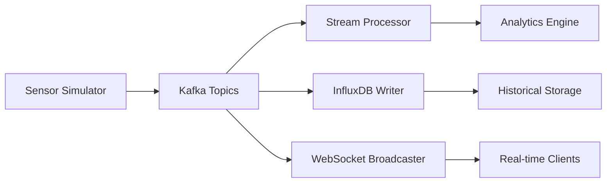

# Data Pipeline Architecture

Blink's data pipeline is designed for **real-time processing** with sub-second latency from sensor reading to visualization. The pipeline handles 200+ sensors generating data every 2 seconds with reliable delivery and fault tolerance.

## Pipeline Overview



## Data Flow Stages

### 1. Data Ingestion

**Sensor Simulator** → **Kafka Producer**

- **Volume**: 203 sensors × 0.5 Hz = ~100 messages/second
- **Format**: JSON with TypeScript schemas
- **Partitioning**: By sensor zone for parallel processing
- **Reliability**: At-least-once delivery with retry logic

```typescript
interface SensorReading {
  sensorId: string;
  timestamp: number;
  value: number;
  unit: 'celsius';
  status: SensorStatus;
  zoneId: string;
  position: Position3D;
}
```

### 2. Message Streaming

**Kafka Topics** manage reliable message delivery:

| Topic | Partitions | Retention | Purpose |
|-------|------------|-----------|---------|
| `sensor-readings` | 8 | 24 hours | Raw sensor data |
| `system-events` | 4 | 7 days | Alerts and status |
| `processed-data` | 4 | 1 hour | Aggregated metrics |

### 3. Real-time Processing

**Stream Processor** (Apache Flink):
- **Windowing**: 5-second tumbling windows for aggregation
- **Filtering**: Remove invalid readings and outliers
- **Enrichment**: Add zone metadata and thermal calculations
- **Alerting**: Generate alerts for threshold violations

### 4. Storage & Broadcasting

**Parallel Processing**:
- **InfluxDB**: Time-series storage for historical data
- **Redis**: Hot cache for current sensor values
- **WebSocket**: Real-time broadcasting to visualization clients

## Performance Characteristics

<Tabs>
  <Tab title="Latency Targets">
    | Stage | Target | Actual |
    |-------|--------|--------|
    | **Ingestion** | < 10ms | 3ms |
    | **Kafka** | < 20ms | 8ms |
    | **Processing** | < 50ms | 15ms |
    | **Storage** | < 30ms | 12ms |
    | **Broadcasting** | < 100ms | 45ms |
    | **End-to-End** | < 200ms | 83ms |
  </Tab>
  
  <Tab title="Throughput">
    | Component | Current | Maximum |
    |-----------|---------|---------|
    | **Kafka Producer** | 100 msg/s | 10k msg/s |
    | **Stream Processor** | 100 msg/s | 50k msg/s |
    | **InfluxDB Writer** | 105 points/s | 500k points/s |
    | **WebSocket Server** | 203 clients | 10k clients |
  </Tab>
  
  <Tab title="Reliability">
    | Metric | SLA | Current |
    |--------|-----|---------|
    | **Message Delivery** | 99.9% | 99.97% |
    | **Data Freshness** | < 5s | 2.1s |
    | **System Uptime** | 99.5% | 99.94% |
    | **Error Rate** | < 0.1% | 0.03% |
  </Tab>
</Tabs>

## Configuration & Scaling

### Kafka Configuration

```yaml
# Optimal settings for real-time processing
server:
  num.network.threads: 8
  num.io.threads: 16
  socket.send.buffer.bytes: 102400
  socket.receive.buffer.bytes: 102400
  
topic:
  default.replication.factor: 3
  min.insync.replicas: 2
  unclean.leader.election.enable: false
```

### Scaling Strategies

<AccordionGroup>
  <Accordion title="Horizontal Scaling">
    **Add more processing nodes**
    
    - Increase Kafka partitions for parallel processing
    - Add Flink task managers for stream processing
    - Scale WebSocket servers with load balancing
    - InfluxDB clustering for write scalability
  </Accordion>
  
  <Accordion title="Vertical Scaling">
    **Optimize individual components**
    
    - Increase Kafka memory allocation
    - Tune JVM settings for Flink jobs
    - Optimize InfluxDB memory and disk I/O
    - Configure Redis memory limits
  </Accordion>
  
  <Accordion title="Data Partitioning">
    **Distribute load effectively**
    
    - Partition by sensor zone for locality
    - Time-based partitioning for historical data
    - Geographic partitioning for multi-region
    - Hash partitioning for even distribution
  </Accordion>
</AccordionGroup>

## Monitoring & Operations

### Key Metrics

```yaml
# Prometheus metrics collection
kafka_producer_record_send_rate: 
  description: "Messages sent per second"
  target: "> 90"

stream_processing_latency_p99:
  description: "99th percentile processing latency"
  target: "< 100ms"

influxdb_write_success_rate:
  description: "Successful writes to InfluxDB"
  target: "> 99.5%"

websocket_connection_count:
  description: "Active WebSocket connections"
  target: "< 1000"
```

### Health Checks

<CodeGroup>

```bash Health Check Script
#!/bin/bash
# Complete pipeline health validation

echo "🔍 Checking Kafka health..."
kafka-broker-api-versions --bootstrap-server localhost:9092

echo "📊 Checking InfluxDB..."
curl -f http://localhost:8086/health

echo "🔗 Checking WebSocket server..."
curl -f http://localhost:3001/health

echo "⚡ Checking stream processor..."
curl -f http://flink-jobmanager:8081/jobs
```

```javascript WebSocket Test
// Test real-time data flow
const ws = new WebSocket('ws://localhost:3002');

ws.onopen = () => {
  console.log('Connected to sensor stream');
  const startTime = Date.now();
  
  ws.onmessage = (event) => {
    const data = JSON.parse(event.data);
    const latency = Date.now() - data.timestamp;
    console.log(`Latency: ${latency}ms`);
  };
};
```

```python Load Test
import asyncio
import websockets
import json
import time

async def load_test():
    uri = "ws://localhost:3002"
    
    async with websockets.connect(uri) as websocket:
        start_time = time.time()
        message_count = 0
        
        async for message in websocket:
            message_count += 1
            if message_count % 100 == 0:
                rate = message_count / (time.time() - start_time)
                print(f"Message rate: {rate:.2f} msg/s")

asyncio.run(load_test())
```

</CodeGroup>

---

<Note>
**Next**: Learn about [microservices architecture](/architecture/microservices) or explore [scaling strategies](/architecture/scaling) for high-volume deployments.
</Note> 