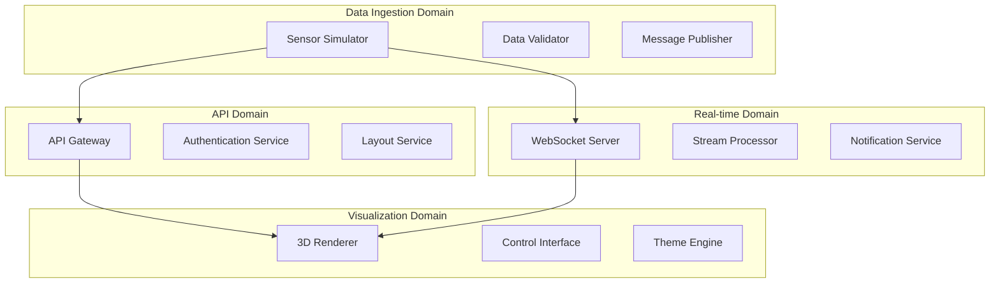

# Microservices Architecture

Blink is built using a **domain-driven microservices architecture** with clear service boundaries, independent deployment, and technology diversity. Each service has a single responsibility and communicates through well-defined APIs.

## Service Overview

<CardGroup cols={2}>
  <Card title="Sensor Simulator" icon="thermometer">
    **Physics-based data generation**
    - Realistic thermal modeling
    - 200+ sensor simulation
    - Configurable failure scenarios
    - Kafka message publishing
  </Card>
  
  <Card title="API Gateway" icon="server">
    **Request routing and aggregation**
    - REST API endpoints
    - Authentication & authorization
    - Rate limiting & caching
    - Health monitoring
  </Card>
  
  <Card title="WebSocket Service" icon="bolt">
    **Real-time communication**
    - Live sensor broadcasting
    - Connection management
    - Message filtering
    - Client subscriptions
  </Card>
  
  <Card title="Visualization Engine" icon="cube">
    **3D interface rendering**
    - React + D3.js frontend
    - Real-time data binding
    - Interactive controls
    - Performance optimization
  </Card>
</CardGroup>

## Service Architecture

### Domain Boundaries



## Service Details

<Tabs>
  <Tab title="Sensor Simulator">
    **Technology Stack**: TypeScript, Bun Runtime, Physics Engine
    
    **Responsibilities**:
    - Generate realistic sensor readings with thermal physics
    - Simulate various failure modes and anomalies
    - Publish data to Kafka topics with proper partitioning
    - Maintain sensor state and historical context
    
    **API Surface**:
    ```typescript
    interface SensorSimulator {
      // Configuration
      updateSensorCount(count: number): void;
      setSensorConfig(config: SensorConfig): void;
      
      // Control
      start(): Promise<void>;
      stop(): Promise<void>;
      pause(): void;
      resume(): void;
      
      // Monitoring
      getStatus(): SimulatorStatus;
      getMetrics(): SimulatorMetrics;
    }
    ```
    
    **Performance**:
    - **Throughput**: 1000+ sensors at 1Hz
    - **Latency**: < 5ms per reading
    - **Memory**: ~50MB for 200 sensors
    - **CPU**: < 5% on modern hardware
  </Tab>
  
  <Tab title="API Gateway">
    **Technology Stack**: Fastify, TypeScript, Redis, InfluxDB
    
    **Responsibilities**:
    - Route requests to appropriate services
    - Implement authentication and authorization
    - Provide caching layer for frequently accessed data
    - Aggregate data from multiple sources
    
    **Endpoints**:
    ```yaml
    # Health & Status
    GET /health                    # System health check
    GET /metrics                   # Prometheus metrics
    
    # Data Center Layout
    GET /api/layout                # Complete layout data
    POST /api/layout               # Update layout
    
    # Sensor Management
    GET /api/sensors               # List all sensors
    GET /api/sensors/{id}          # Individual sensor
    GET /api/sensors/{id}/history  # Historical data
    
    # Real-time Status
    GET /api/realtime/status       # Current system state
    ```
    
    **Performance**:
    - **Response Time**: < 50ms average
    - **Throughput**: 2000+ requests/second
    - **Availability**: 99.9% uptime SLA
    - **Caching**: 95%+ cache hit rate
  </Tab>
  
  <Tab title="WebSocket Service">
    **Technology Stack**: Node.js WebSocket, Redis Pub/Sub
    
    **Responsibilities**:
    - Maintain persistent connections with clients
    - Broadcast real-time sensor updates
    - Handle client subscriptions and filtering
    - Manage connection health and reconnection
    
    **Message Types**:
    ```typescript
    // Outbound Messages
    interface SensorUpdate {
      type: 'sensor_reading';
      sensorId: string;
      value: number;
      timestamp: number;
      metadata: SensorMetadata;
    }
    
    interface SystemAlert {
      type: 'system_alert';
      severity: 'info' | 'warning' | 'error';
      message: string;
      details: Record<string, any>;
    }
    
    // Inbound Messages  
    interface SubscriptionRequest {
      type: 'subscribe';
      topics: string[];
      filters?: SubscriptionFilters;
    }
    ```
    
    **Performance**:
    - **Connections**: 1000+ concurrent
    - **Latency**: < 20ms message delivery
    - **Bandwidth**: ~1KB/second per client
    - **Reliability**: Automatic reconnection
  </Tab>
  
  <Tab title="Visualization Engine">
    **Technology Stack**: React 18, D3.js, TypeScript, Vite
    
    **Responsibilities**:
    - Render 3D data center visualization
    - Handle user interactions and controls
    - Manage real-time data updates
    - Optimize rendering performance
    
    **Components**:
    ```typescript
    // Core Components
    interface VisualizationComponents {
      DataCenterRenderer: React.FC<{
        layout: DataCenterLayout;
        sensorData: SensorReading[];
      }>;
      
      ControlPanel: React.FC<{
        onViewChange: (view: ViewConfig) => void;
        onFilterChange: (filters: DataFilters) => void;
      }>;
      
      SensorDetails: React.FC<{
        sensor: Sensor;
        history: SensorReading[];
      }>;
    }
    ```
    
    **Performance**:
    - **Frame Rate**: 60 FPS with 200+ sensors
    - **Memory**: ~100MB for full visualization
    - **Startup Time**: < 2 seconds initial load
    - **Update Latency**: < 16ms per frame
  </Tab>
</Tabs>

## Inter-Service Communication

### Communication Patterns

<AccordionGroup>
  <Accordion title="Event-Driven Messaging">
    **Kafka Topics for Asynchronous Communication**
    
    ```yaml
    # Topic Configuration
    sensor-readings:
      partitions: 8
      replication: 3
      retention: 24h
      
    system-events:
      partitions: 4
      replication: 3
      retention: 7d
      
    layout-updates:
      partitions: 2
      replication: 3
      retention: 30d
    ```
    
    **Benefits**:
    - Loose coupling between services
    - Reliable message delivery
    - Scalable processing
    - Event replay capability
  </Accordion>
  
  <Accordion title="Synchronous APIs">
    **REST APIs for Request-Response Patterns**
    
    ```typescript
    // Service-to-Service Communication
    interface ServiceClient {
      async getLayout(): Promise<DataCenterLayout>;
      async getSensorStatus(id: string): Promise<SensorStatus>;
      async updateConfiguration(config: SystemConfig): Promise<void>;
    }
    
    // With Circuit Breaker Pattern
    const apiClient = new CircuitBreakerClient({
      failureThreshold: 5,
      timeout: 30000,
      resetTimeout: 60000
    });
    ```
    
    **Use Cases**:
    - Configuration updates
    - Data queries
    - Health checks
    - Administrative operations
  </Accordion>
  
  <Accordion title="Real-time Streaming">
    **WebSocket for Live Data Delivery**
    
    ```typescript
    // Publisher-Subscriber Pattern
    class RealtimePublisher {
      private subscribers = new Map<string, WebSocket[]>();
      
      publish(topic: string, data: any) {
        const message = JSON.stringify({ topic, data, timestamp: Date.now() });
        
        this.subscribers.get(topic)?.forEach(ws => {
          if (ws.readyState === WebSocket.OPEN) {
            ws.send(message);
          }
        });
      }
    }
    ```
    
    **Features**:
    - Topic-based subscriptions
    - Client filtering
    - Connection management
    - Automatic cleanup
  </Accordion>
</AccordionGroup>

## Service Discovery & Configuration

### Service Registry

```yaml
# Consul Service Discovery
services:
  api-gateway:
    address: api-gateway.service.consul
    port: 3001
    health_check:
      http: "http://api-gateway.service.consul:3001/health"
      interval: "10s"
      
  websocket-server:
    address: websocket.service.consul  
    port: 3002
    health_check:
      tcp: "websocket.service.consul:3002"
      interval: "10s"
      
  sensor-simulator:
    address: simulator.service.consul
    port: 3003
    health_check:
      http: "http://simulator.service.consul:3003/status"
      interval: "30s"
```

### Configuration Management

<CodeGroup>

```yaml Environment Configuration
# Production Environment
production:
  kafka:
    brokers: ["kafka-1:9092", "kafka-2:9092", "kafka-3:9092"]
    replication_factor: 3
    
  redis:
    cluster:
      - "redis-1:6379"
      - "redis-2:6379" 
      - "redis-3:6379"
      
  influxdb:
    url: "http://influxdb-cluster:8086"
    database: "sensors"
    retention_policy: "90d"

# Development Environment  
development:
  kafka:
    brokers: ["localhost:9092"]
    replication_factor: 1
    
  redis:
    host: "localhost"
    port: 6379
    
  influxdb:
    url: "http://localhost:8086"
    database: "sensors_dev"
    retention_policy: "7d"
```

```typescript Service Configuration
// Dynamic Configuration Loading
interface ServiceConfig {
  kafka: KafkaConfig;
  redis: RedisConfig;
  influxdb: InfluxDBConfig;
  monitoring: MonitoringConfig;
}

class ConfigManager {
  private config: ServiceConfig;
  private watchers: Map<string, Function[]> = new Map();
  
  async loadConfig(): Promise<void> {
    // Load from environment, Consul, or config files
    this.config = await this.fetchConfiguration();
    this.notifyWatchers();
  }
  
  watch(key: string, callback: Function): void {
    const callbacks = this.watchers.get(key) || [];
    callbacks.push(callback);
    this.watchers.set(key, callbacks);
  }
}
```

</CodeGroup>

## Deployment & Orchestration

### Container Strategy

```dockerfile
# Multi-stage build for each service
FROM bun:latest AS builder
WORKDIR /app
COPY package.json bun.lockb ./
RUN bun install --frozen-lockfile

COPY src/ ./src/
RUN bun run build

FROM bun:slim AS runtime
WORKDIR /app
COPY --from=builder /app/dist ./dist
COPY --from=builder /app/node_modules ./node_modules

EXPOSE 3001
HEALTHCHECK --interval=30s --timeout=10s --start-period=60s \
  CMD curl -f http://localhost:3001/health || exit 1

CMD ["bun", "run", "dist/index.js"]
```

### Kubernetes Deployment

```yaml
apiVersion: apps/v1
kind: Deployment
metadata:
  name: api-gateway
spec:
  replicas: 3
  selector:
    matchLabels:
      app: api-gateway
  template:
    spec:
      containers:
      - name: api-gateway
        image: blink/api-gateway:v1.0.0
        ports:
        - containerPort: 3001
        env:
        - name: KAFKA_BROKERS
          value: "kafka-cluster:9092"
        - name: REDIS_URL
          value: "redis://redis-cluster:6379"
        resources:
          requests:
            memory: "256Mi"
            cpu: "250m"
          limits:
            memory: "512Mi"
            cpu: "500m"
        livenessProbe:
          httpGet:
            path: /health
            port: 3001
          initialDelaySeconds: 30
          periodSeconds: 10
        readinessProbe:
          httpGet:
            path: /ready
            port: 3001
          initialDelaySeconds: 5
          periodSeconds: 5
```

---

<Note>
**Next**: Explore [scaling strategies](/architecture/scaling) for handling increased load, or dive into the [data pipeline](/architecture/data-pipeline) details.
</Note> 