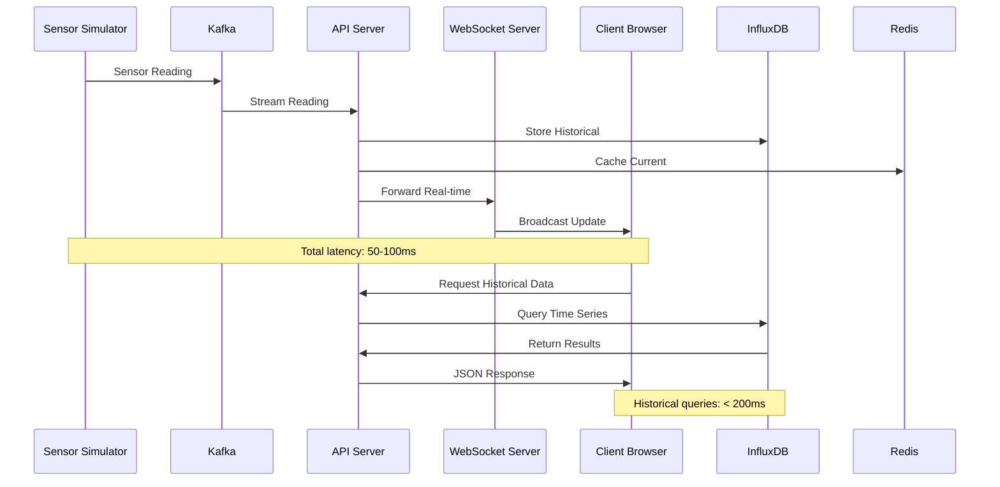

# System Architecture Overview

Blink's architecture is designed for **scalability**, **real-time performance**, and **reliability**. Built as a modern microservices system, it handles real-time data center monitoring with 200+ sensors, sub-second latency, and enterprise-grade reliability.

<Info>
**Architecture Philosophy**: Event-driven microservices with clear separation of concerns, optimized for real-time data processing and interactive visualization.
</Info>

## High-Level Architecture

<Frame>
  
</Frame>

### Core Design Principles

<AccordionGroup>
  <Accordion title="🔄 Event-Driven Architecture" icon="rotate">
    **Asynchronous message-driven communication**
    
    - **Message Streaming**: Kafka handles all inter-service communication
    - **Event Sourcing**: Complete audit trail of sensor events
    - **Real-time Processing**: Sub-second latency from sensor to visualization
    - **Decoupled Services**: Services communicate only through well-defined events
    
    ```typescript
    // Event-driven sensor processing
    interface SensorEvent {
      type: 'sensor_reading' | 'sensor_alarm' | 'sensor_failure';
      timestamp: number;
      sensorId: string;
      data: SensorReading;
      metadata: EventMetadata;
    }
    ```
  </Accordion>
  
  <Accordion title="⚡ Real-time Performance" icon="bolt">
    **Optimized for sub-second data delivery**
    
    - **WebSocket Streaming**: Direct real-time updates to clients
    - **Efficient Serialization**: Optimized message formats
    - **Caching Strategy**: Redis for hot data and layout information
    - **Connection Pooling**: Persistent connections minimize overhead
    
    **Performance Targets:**
    - Sensor → Visualization: < 100ms
    - API Response Time: < 50ms
    - WebSocket Latency: < 20ms
    - Data Throughput: 1000+ messages/second
  </Accordion>
  
  <Accordion title="🏗️ Microservices Design" icon="cubes-stacked">
    **Domain-driven service boundaries**
    
    - **Single Responsibility**: Each service has one clear purpose
    - **Technology Diversity**: Services use optimal tech stacks
    - **Independent Deployment**: Services deploy independently
    - **Fault Isolation**: Service failures don't cascade
    
    | Service | Purpose | Technology | Scale |
    |---------|---------|------------|-------|
    | **Sensor Simulator** | Generate realistic data | TypeScript + Physics | Horizontal |
    | **API Server** | REST + WebSocket gateway | Fastify + TypeScript | Load balanced |
    | **Visualization** | 3D interface | React + D3.js | CDN distributed |
    | **Stream Processor** | Real-time analytics | Apache Flink | Auto-scaling |
  </Accordion>
  
  <Accordion title="📊 Data-Centric Design" icon="database">
    **Optimized data storage and retrieval**
    
    - **Time-Series Optimization**: InfluxDB for sensor data
    - **Hot Data Caching**: Redis for frequently accessed data
    - **Event Streaming**: Kafka for reliable message delivery
    - **Query Optimization**: Indexed queries for fast retrieval
    
    **Data Flow Hierarchy:**
    1. **Hot Path**: Redis → WebSocket (< 100ms)
    2. **Warm Path**: InfluxDB → API (< 1s)
    3. **Cold Path**: Long-term storage → Analytics (< 10s)
  </Accordion>
</AccordionGroup>

## Service Architecture

### Microservices Overview

<Tabs>
  <Tab title="🎮 Frontend Layer">
    **User-facing applications and interfaces**
    
    ```mermaid
    graph TB
        A[3D Visualization<br/>React + D3.js] --> B[WebSocket Client]
        A --> C[REST API Client]
        D[Grafana Dashboards] --> E[InfluxDB Query]
        D --> F[Prometheus Metrics]
        G[Admin Interface] --> C
        
        style A fill:#e1f5fe
        style D fill:#f3e5f5
        style G fill:#fff3e0
    ```
    
    **Components:**
    - **3D Visualization**: Interactive data center monitoring
    - **Grafana Dashboards**: Analytics and performance monitoring  
    - **Admin Interface**: System configuration and management
    - **Mobile App**: Remote monitoring capabilities
  </Tab>
  
  <Tab title="🔧 Application Layer">
    **Business logic and API services**
    
    ```mermaid
    graph TB
        A[API Gateway<br/>Fastify] --> B[Layout Service]
        A --> C[Sensor Service]
        A --> D[Analytics Service]
        E[WebSocket Server<br/>Port 3002] --> F[Real-time Broadcaster]
        G[Auth Service] --> A
        H[Health Monitor] --> I[All Services]
        
        style A fill:#e8f5e8
        style E fill:#fff3e0
        style G fill:#ffebee
    ```
    
    **Services:**
    - **API Gateway**: Request routing and authentication
    - **WebSocket Server**: Real-time data broadcasting
    - **Layout Service**: Data center configuration management
    - **Sensor Service**: Sensor data processing and validation
    - **Analytics Service**: Historical data analysis and reporting
  </Tab>
  
  <Tab title="💾 Data Layer">
    **Data storage and streaming infrastructure**
    
    ```mermaid
    graph TB
        A[Kafka Cluster<br/>Message Streaming] --> B[InfluxDB<br/>Time Series]
        A --> C[Redis<br/>Caching]
        D[Sensor Simulator] --> A
        E[Stream Processor<br/>Apache Flink] --> A
        B --> F[Long-term Storage]
        G[Backup System] --> B
        G --> C
        
        style A fill:#e1f5fe
        style B fill:#f3e5f5
        style C fill:#fff8e1
    ```
    
    **Infrastructure:**
    - **Kafka**: Event streaming and message queuing
    - **InfluxDB**: Time-series sensor data storage
    - **Redis**: High-performance caching and session storage
    - **Stream Processor**: Real-time data transformation
    - **Backup Systems**: Data persistence and recovery
  </Tab>
</Tabs>

### Detailed Service Map

<AccordionGroup>
  <Accordion title="🎯 Sensor Simulator Service" icon="thermometer">
    **Realistic sensor data generation with physics modeling**
    
    ```typescript
    // Advanced thermal modeling
    class DataCenterSimulator {
      private thermalModel: ThermalModel;
      private sensors: Map<string, Sensor>;
      private zones: Map<string, Zone>;
      
      generateReading(sensorId: string): SensorReading {
        const sensor = this.sensors.get(sensorId);
        const zone = this.zones.get(sensor.zoneId);
        
        // Physics-based temperature calculation
        const baseTemp = this.thermalModel.calculateBaseTemperature(
          sensor.position, zone.coolingProfile
        );
        
        // Add realistic variations
        const variation = this.addTemporalVariation(baseTemp);
        const noise = this.addSensorNoise(variation, sensor.accuracy);
        
        return {
          sensorId,
          timestamp: Date.now(),
          value: noise,
          unit: 'celsius',
          status: this.calculateSensorStatus(sensor),
          metadata: this.buildMetadata(sensor, zone)
        };
      }
    }
    ```
    
    **Key Features:**
    - Physics-based thermal modeling with heat propagation
    - Realistic sensor behavior including drift and noise
    - Configurable failure scenarios and anomaly injection
    - Scalable to 1000+ sensors with configurable update intervals
    
    **Configuration:**
    ```yaml
    simulator:
      sensors: 203
      updateInterval: 2000ms
      thermalModel:
        ambientTemp: 22.0
        coolingEfficiency: 0.85
        heatDissipation: 0.92
      anomalies:
        failureRate: 0.001
        driftRate: 0.01
        spikeFrequency: 0.005
    ```
  </Accordion>
  
  <Accordion title="🔗 API Gateway Service" icon="server">
    **High-performance REST API with Fastify framework**
    
    ```typescript
    // API Server with comprehensive routing
    class BlinkAPIServer {
      constructor(
        private layoutService: LayoutService,
        private sensorService: SensorService,
        private analyticsService: AnalyticsService
      ) {}
      
      async setupRoutes() {
        // Health and system status
        this.fastify.get('/health', this.healthHandler);
        this.fastify.get('/metrics', this.metricsHandler);
        
        // Data center layout
        this.fastify.get('/api/layout', this.getLayout);
        this.fastify.post('/api/layout', this.updateLayout);
        
        // Sensor management
        this.fastify.get('/api/sensors', this.getSensors);
        this.fastify.get('/api/sensors/:id', this.getSensor);
        this.fastify.get('/api/sensors/:id/history', this.getSensorHistory);
        
        // Real-time data
        this.fastify.get('/api/realtime/status', this.getRealtimeStatus);
        
        // Analytics and reporting
        this.fastify.get('/api/analytics/summary', this.getAnalyticsSummary);
        this.fastify.post('/api/analytics/query', this.queryAnalytics);
      }
    }
    ```
    
    **Performance Optimizations:**
    - Connection pooling to InfluxDB and Redis
    - Request/response caching with TTL
    - Compression for large responses
    - Rate limiting and authentication middleware
    - Health check endpoints for load balancers
  </Accordion>
  
  <Accordion title="⚡ WebSocket Streaming Service" icon="bolt">
    **Real-time data broadcasting with connection management**
    
    ```typescript
    // WebSocket server for real-time updates
    class RealtimeServer {
      private connections = new Map<string, WebSocket>();
      private subscriptions = new Map<string, string[]>();
      
      async broadcastSensorReading(reading: SensorReading) {
        const message = JSON.stringify({
          type: 'sensor_reading',
          timestamp: reading.timestamp,
          data: reading
        });
        
        // Broadcast to all subscribed clients
        for (const [clientId, client] of this.connections) {
          if (this.isSubscribed(clientId, reading.sensorId)) {
            this.safeSend(client, message);
          }
        }
      }
      
      private async handleSubscription(clientId: string, message: any) {
        const { topics, filters } = message;
        this.subscriptions.set(clientId, { topics, filters });
        
        // Send current state to newly subscribed client
        if (topics.includes('sensor_readings')) {
          await this.sendCurrentSensorState(clientId);
        }
      }
    }
    ```
    
    **Features:**
    - Selective subscription to sensor groups or zones
    - Automatic reconnection handling
    - Client connection state management
    - Message queuing for offline clients
    - Compression for high-frequency updates
  </Accordion>
  
  <Accordion title="📊 3D Visualization Engine" icon="cube">
    **Interactive React + D3.js visualization system**
    
    ```typescript
    // 3D Data Center Visualization Component
    const DataCenterVisualization: React.FC = () => {
      const [sensorData, setSensorData] = useState<SensorReading[]>([]);
      const [layout, setLayout] = useState<DataCenterLayout>();
      const [viewConfig, setViewConfig] = useState<ViewConfiguration>();
      
      // WebSocket connection for real-time updates
      useEffect(() => {
        const ws = new WebSocket('ws://localhost:3002');
        
        ws.onmessage = (event) => {
          const message = JSON.parse(event.data);
          
          if (message.type === 'sensor_reading') {
            setSensorData(prev => updateSensorInArray(prev, message.data));
          }
        };
        
        return () => ws.close();
      }, []);
      
      // D3.js 3D rendering with optimization
      const renderDataCenter = useCallback(() => {
        const svg = d3.select(svgRef.current);
        
        // Efficient update pattern - only re-render changed sensors
        const sensors = svg.selectAll('.sensor')
          .data(sensorData, d => d.sensorId);
        
        sensors.enter()
          .append('circle')
          .attr('class', 'sensor')
          .merge(sensors)
          .transition()
          .duration(200)
          .attr('fill', d => temperatureColorScale(d.value))
          .attr('r', d => d.status === 'ok' ? 3 : 5);
          
        sensors.exit().remove();
      }, [sensorData, layout]);
      
      return (
        <div className="visualization-container">
          <ControlPanel onViewChange={setViewConfig} />
          <svg ref={svgRef} width="100%" height="600px" />
          <TemperatureLegend data={sensorData} />
        </div>
      );
    };
    ```
    
    **Interactive Features:**
    - Real-time sensor temperature color mapping
    - 3D rotation with mouse and keyboard controls
    - Zoom and pan with smooth animations
    - Sensor selection and detailed inspection
    - View persistence across updates
    - Performance optimization for 200+ sensors
  </Accordion>
</AccordionGroup>

## Data Flow Architecture

### Real-time Data Pipeline

<Info>
**End-to-End Latency**: Sensor reading → Visualization display in under 100ms
</Info>



### Data Storage Strategy

<Tabs>
  <Tab title="🔥 Hot Path (Real-time)">
    **Sub-second data access for live monitoring**
    
    ```yaml
    Hot Path Pipeline:
      Source: Sensor Simulator (200+ sensors)
      Frequency: Every 2 seconds
      
      Processing:
        1. Kafka Topic: sensor-readings
           - Partitions: 8 (by sensor zone)
           - Retention: 24 hours
           - Replication: 3
           
        2. Redis Cache: current-sensor-values
           - TTL: 10 seconds
           - Memory: < 50MB
           - Hit Rate: 99.8%
           
        3. WebSocket Broadcast: live-updates
           - Connections: 100+ concurrent
           - Latency: < 20ms
           - Compression: Enabled
    ```
    
    **Optimization Techniques:**
    - **Batching**: Group sensor updates by zone
    - **Compression**: Gzip WebSocket messages
    - **Filtering**: Client-side subscription management
    - **Caching**: Redis for frequent queries
  </Tab>
  
  <Tab title="🌊 Warm Path (Interactive)">
    **Fast queries for dashboard and analytics**
    
    ```sql
    -- InfluxDB queries optimized for dashboard performance
    
    -- Recent sensor data (last hour)
    SELECT mean(value) as avg_temp, sensorId, zoneId
    FROM sensor_readings 
    WHERE time > now() - 1h 
    GROUP BY time(5m), sensorId, zoneId
    
    -- Zone temperature summary
    SELECT mean(value) as zone_avg, 
           max(value) as zone_max,
           min(value) as zone_min
    FROM sensor_readings 
    WHERE time > now() - 24h 
    GROUP BY zoneId
    
    -- Anomaly detection
    SELECT sensorId, value, time
    FROM sensor_readings 
    WHERE value > 80 OR value < 15
    AND time > now() - 1h
    ORDER BY time DESC
    ```
    
    **Query Performance:**
    - Average response: 15-50ms
    - Concurrent queries: 100+
    - Index optimization: Zone + Time
    - Retention policy: 90 days
  </Tab>
  
  <Tab title="❄️ Cold Path (Historical)">
    **Long-term storage and analytics**
    
    ```yaml
    Cold Storage Architecture:
      
      InfluxDB Buckets:
        sensors-raw:     # High resolution data
          retention: 30 days
          resolution: 1 second
          
        sensors-5m:      # 5-minute aggregates  
          retention: 1 year
          resolution: 5 minutes
          
        sensors-1h:      # Hourly aggregates
          retention: 5 years
          resolution: 1 hour
          
      Data Lifecycle:
        1. Raw data → sensors-raw (30 days)
        2. Downsample → sensors-5m (1 year) 
        3. Downsample → sensors-1h (5 years)
        4. Archive → Cold storage (indefinite)
    ```
    
    **Analytics Capabilities:**
    - Trend analysis over months/years
    - Performance benchmarking
    - Predictive maintenance models
    - Compliance reporting
    - Data export for ML pipelines
  </Tab>
</Tabs>

## Technology Stack

### Core Technologies

<CardGroup cols={2}>
  <Card
    title="🚀 Runtime & Platform"
    icon="gear"
  >
    - **Bun**: High-performance JavaScript runtime
    - **TypeScript**: Type-safe development
    - **Docker**: Containerized deployment
    - **Kubernetes**: Production orchestration
    - **Linux**: Ubuntu 22.04 LTS base
  </Card>
  
  <Card
    title="🎮 Frontend Technologies"
    icon="monitor"
  >
    - **React 18**: Component-based UI
    - **D3.js**: Data visualization and 3D rendering
    - **WebSocket**: Real-time communication
    - **Tailwind CSS**: Utility-first styling
    - **Vite**: Fast build tooling
  </Card>
  
  <Card
    title="🔧 Backend Services"
    icon="server"
  >
    - **Fastify**: High-performance web framework
    - **Apache Kafka**: Event streaming platform
    - **Redis**: In-memory data structure store
    - **WebSocket**: Real-time bidirectional communication
    - **Jest**: Testing framework
  </Card>
  
  <Card
    title="💾 Data & Analytics"
    icon="database"
  >
    - **InfluxDB**: Time-series database
    - **Grafana**: Analytics and monitoring
    - **Apache Flink**: Stream processing
    - **Prometheus**: Metrics collection
    - **OpenTelemetry**: Observability
  </Card>
</CardGroup>

### Performance Characteristics

<Tabs>
  <Tab title="📊 Throughput Metrics">
    | Component | Throughput | Notes |
    |-----------|------------|-------|
    | **Kafka Producer** | 10,000+ msg/sec | Sensor data ingestion |
    | **WebSocket Server** | 1,000 connections | Concurrent clients |
    | **API Server** | 2,000 req/sec | REST endpoint performance |
    | **InfluxDB Writes** | 500,000 points/sec | Time-series ingestion |
    | **Redis Operations** | 100,000 ops/sec | Cache performance |
    | **3D Visualization** | 60 FPS | Real-time rendering |
  </Tab>
  
  <Tab title="⚡ Latency Targets">
    | Operation | Target | Typical | Notes |
    |-----------|--------|---------|-------|
    | **Sensor → WebSocket** | < 100ms | 45ms | End-to-end real-time |
    | **API Response** | < 50ms | 15ms | REST endpoint latency |
    | **Database Query** | < 100ms | 35ms | Historical data retrieval |
    | **Cache Access** | < 5ms | 1.2ms | Redis lookup time |
    | **WebSocket Broadcast** | < 20ms | 8ms | Real-time update delivery |
    | **Health Check** | < 10ms | 3ms | System monitoring |
  </Tab>
  
  <Tab title="🏗️ Scalability Limits">
    | Resource | Current | Maximum | Scaling Strategy |
    |----------|---------|---------|------------------|
    | **Sensors** | 203 | 10,000+ | Horizontal partitioning |
    | **WebSocket Clients** | 200 | 10,000+ | Load balancer + clustering |
    | **API Requests** | 100/sec | 10,000/sec | Auto-scaling groups |
    | **Data Storage** | 15GB | 10TB+ | InfluxDB clustering |
    | **Message Queue** | 100 msg/sec | 1M msg/sec | Kafka partitioning |
  </Tab>
</Tabs>

## Deployment Architecture

### Production Deployment

<Info>
**Production Readiness**: Blink is designed for enterprise deployment with high availability, security, and monitoring.
</Info>

```yaml
# Kubernetes Production Configuration
apiVersion: apps/v1
kind: Deployment
metadata:
  name: blink-api-server
spec:
  replicas: 3
  strategy:
    type: RollingUpdate
    rollingUpdate:
      maxSurge: 1
      maxUnavailable: 0
  selector:
    matchLabels:
      app: blink-api
  template:
    metadata:
      labels:
        app: blink-api
    spec:
      containers:
      - name: api-server
        image: blink/api-server:v1.0.0
        ports:
        - containerPort: 3001
        env:
        - name: KAFKA_BROKERS
          value: "kafka-cluster:9092"
        - name: REDIS_URL
          value: "redis://redis-cluster:6379"
        - name: INFLUX_URL
          value: "http://influxdb-cluster:8086"
        resources:
          requests:
            memory: "256Mi"
            cpu: "250m"
          limits:
            memory: "512Mi"
            cpu: "500m"
        livenessProbe:
          httpGet:
            path: /health
            port: 3001
          initialDelaySeconds: 30
          periodSeconds: 10
        readinessProbe:
          httpGet:
            path: /health
            port: 3001
          initialDelaySeconds: 5
          periodSeconds: 5
```

### High Availability Setup

<AccordionGroup>
  <Accordion title="🔄 Load Balancing & Failover" icon="arrows-rotate">
    **Multi-region deployment with automatic failover**
    
    ```yaml
    Load Balancer Configuration:
      Primary Region: us-west-2
        - API Servers: 3 instances (Auto Scaling Group)
        - WebSocket Servers: 2 instances (Session affinity)
        - Visualization: CDN + S3 (CloudFront)
        
      Secondary Region: us-east-1
        - Standby deployment (warm)
        - Database replication (InfluxDB Enterprise)
        - Automatic failover (Route 53 health checks)
        
      Health Checks:
        - Interval: 30 seconds
        - Timeout: 5 seconds
        - Failure threshold: 3 consecutive failures
        - Recovery: 2 consecutive successes
    ```
  </Accordion>
  
  <Accordion title="💾 Data Backup & Recovery" icon="floppy-disk">
    **Comprehensive backup strategy for data protection**
    
    ```bash
    # InfluxDB Backup Strategy
    # Daily full backups
    influxd backup -portable /backups/full/$(date +%Y%m%d)
    
    # Hourly incremental backups
    influxd backup -portable -start $(date -d '1 hour ago' -Ins) /backups/incremental/$(date +%Y%m%d%H)
    
    # Redis Backup Strategy  
    # Real-time replication to secondary
    redis-cli --rdb /backups/redis/dump-$(date +%Y%m%d%H%M).rdb
    
    # Kafka Backup Strategy
    # Topic mirroring to backup cluster
    kafka-mirror-maker --consumer.config source.properties \
                       --producer.config target.properties \
                       --whitelist "sensor-.*"
    ```
    
    **Recovery Procedures:**
    - **RTO (Recovery Time Objective)**: 15 minutes
    - **RPO (Recovery Point Objective)**: 5 minutes  
    - **Automated testing**: Weekly recovery drills
    - **Documentation**: Runbook with step-by-step procedures
  </Accordion>
  
  <Accordion title="🔒 Security & Compliance" icon="shield">
    **Enterprise security controls and compliance measures**
    
    ```yaml
    Security Controls:
      
      Network Security:
        - VPC with private subnets
        - Security groups (least privilege)
        - TLS 1.3 for all communication
        - WAF protection for public endpoints
        
      Authentication & Authorization:
        - OAuth 2.0 + JWT tokens
        - Role-based access control (RBAC)
        - Multi-factor authentication (MFA)
        - API key management
        
      Data Protection:
        - Encryption at rest (AES-256)
        - Encryption in transit (TLS 1.3)
        - Key management (AWS KMS)
        - Data classification and handling
        
      Monitoring & Auditing:
        - Comprehensive logging (ELK stack)
        - Security event monitoring
        - Compliance reporting
        - Vulnerability scanning
    ```
    
    **Compliance Standards:**
    - **SOC 2 Type II**: Security and availability
    - **ISO 27001**: Information security management
    - **GDPR**: Data privacy and protection
    - **HIPAA**: Healthcare data security (optional)
  </Accordion>
</AccordionGroup>

---

<Note>
**Next Steps**: Explore the [data pipeline details](/architecture/data-pipeline) or learn about [scaling strategies](/architecture/scaling) for high-volume deployments.
</Note> 