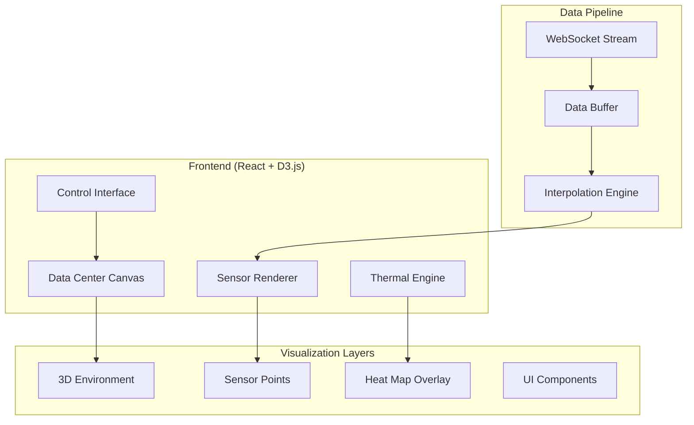

# 3D Visualization Overview

Blink's **3D Visualization Engine** provides an immersive, real-time view of your data center with accurate thermal mapping, interactive sensor exploration, and comprehensive environmental monitoring. Built with React and D3.js for maximum performance and flexibility.

## Key Features

<CardGroup cols={2}>
  <Card title="Real-time Thermal Mapping" icon="temperature-high">
    **Live temperature visualization**
    - Color-coded heat maps
    - Gradient interpolation
    - Hot spot identification
    - Temperature contours
  </Card>
  
  <Card title="Interactive Sensor Exploration" icon="magnifying-glass">
    **Click to explore any sensor**
    - Detailed sensor information
    - Historical trend charts
    - Alert status indicators
    - Maintenance scheduling
  </Card>
  
  <Card title="🎮 Immersive Controls" icon="gamepad">
    **Navigate with ease**
    - Pan, zoom, and rotate
    - Preset camera angles
    - Walkthrough mode
    - VR compatibility
  </Card>
  
  <Card title="High Performance" icon="bolt">
    **Optimized for scale**
    - 60 FPS with 1000+ sensors
    - WebGL acceleration
    - Efficient data streaming
    - Progressive loading
  </Card>
</CardGroup>

## Architecture Overview



## Live Demo

<Info>
**Access the live visualization**: [http://localhost:3002](http://localhost:3002)

The 3D interface shows all 203 sensors with real-time updates every 2 seconds.
</Info>

## Technical Stack

### Core Technologies

<Tabs>
  <Tab title="React 18">
    **Modern React with Concurrent Features**
    
    ```typescript
    // Component Structure
    interface VisualizationApp {
      DataCenterRenderer: React.FC<{
        sensors: Sensor[];
        layout: DataCenterLayout;
        theme: VisualizationTheme;
      }>;
      
      ControlPanel: React.FC<{
        onViewChange: (view: CameraView) => void;
        onFilterChange: (filters: SensorFilters) => void;
        onThemeChange: (theme: string) => void;
      }>;
      
      SensorDetails: React.FC<{
        sensor: Sensor | null;
        history: SensorReading[];
        onClose: () => void;
      }>;
    }
    
    // Performance Optimizations
    const DataCenterRenderer = React.memo(({ sensors, layout }) => {
      const memoizedSensors = useMemo(() => 
        sensors.filter(s => s.isVisible), [sensors]
      );
      
      const canvasRef = useRef<HTMLCanvasElement>(null);
      
      useEffect(() => {
        // WebGL rendering pipeline
        const renderer = new ThreeRenderer(canvasRef.current);
        renderer.updateSensors(memoizedSensors);
      }, [memoizedSensors]);
      
      return <canvas ref={canvasRef} className="w-full h-full" />;
    });
    ```
  </Tab>
  
  <Tab title="D3.js">
    **Data-Driven Visualizations**
    
    ```typescript
    // D3.js Integration for Data Processing
    import * as d3 from 'd3';
    
    class ThermalMapGenerator {
      private colorScale: d3.ScaleSequential<string>;
      private interpolator: d3.Delaunay<[number, number]>;
      
      constructor() {
        // Temperature color scale
        this.colorScale = d3.scaleSequential(d3.interpolateInferno)
          .domain([15, 35]); // Celsius range
      }
      
      generateHeatMap(sensors: SensorReading[]): HeatMapData {
        // Create Delaunay triangulation for smooth interpolation
        const points: [number, number][] = sensors.map(s => [s.x, s.y]);
        const values = sensors.map(s => s.temperature);
        
        this.interpolator = d3.Delaunay.from(points);
        
        // Generate heat map grid
        const gridSize = 50;
        const heatMap: number[][] = [];
        
        for (let x = 0; x < gridSize; x++) {
          heatMap[x] = [];
          for (let y = 0; y < gridSize; y++) {
            const point: [number, number] = [
              (x / gridSize) * DATACENTER_WIDTH,
              (y / gridSize) * DATACENTER_DEPTH
            ];
            
            // Find nearest sensors and interpolate
            const nearestIndex = this.interpolator.find(...point);
            heatMap[x][y] = this.interpolateTemperature(point, sensors);
          }
        }
        
        return {
          grid: heatMap,
          colorScale: this.colorScale,
          dimensions: { width: gridSize, height: gridSize }
        };
      }
    }
    ```
  </Tab>
  
  <Tab title="Three.js">
    **3D Rendering Engine**
    
    ```typescript
    // Three.js 3D Scene Management
    import * as THREE from 'three';
    
    export class DataCenter3DRenderer {
      private scene: THREE.Scene;
      private camera: THREE.PerspectiveCamera;
      private renderer: THREE.WebGLRenderer;
      private controls: THREE.OrbitControls;
      
      constructor(canvas: HTMLCanvasElement) {
        this.scene = new THREE.Scene();
        this.camera = new THREE.PerspectiveCamera(75, canvas.width / canvas.height, 0.1, 1000);
        this.renderer = new THREE.WebGLRenderer({ canvas, antialias: true });
        
        // Setup scene
        this.setupLighting();
        this.setupEnvironment();
        this.setupControls();
      }
      
      private setupEnvironment(): void {
        // Data center floor
        const floorGeometry = new THREE.PlaneGeometry(100, 50);
        const floorMaterial = new THREE.MeshStandardMaterial({ 
          color: 0x404040,
          roughness: 0.8 
        });
        const floor = new THREE.Mesh(floorGeometry, floorMaterial);
        floor.rotation.x = -Math.PI / 2;
        this.scene.add(floor);
        
        // Server racks
        this.createServerRacks();
      }
      
      updateSensorVisualization(sensors: SensorReading[]): void {
        sensors.forEach(sensor => {
          const sensorMesh = this.getSensorMesh(sensor.id);
          if (sensorMesh) {
            // Update color based on temperature
            const color = this.getTemperatureColor(sensor.temperature);
            (sensorMesh.material as THREE.MeshStandardMaterial).color.setHex(color);
            
            // Update position if needed
            sensorMesh.position.set(sensor.x, sensor.y, sensor.z);
            
            // Add pulsing animation for alerts
            if (sensor.status === 'alert') {
              this.addPulsingAnimation(sensorMesh);
            }
          }
        });
      }
      
      render(): void {
        this.controls.update();
        this.renderer.render(this.scene, this.camera);
      }
    }
    ```
  </Tab>
  
  <Tab title="WebGL">
    **Hardware Acceleration**
    
    ```typescript
    // Custom WebGL Shaders for Performance
    const vertexShader = `
      attribute vec3 position;
      attribute vec3 color;
      attribute float temperature;
      
      uniform mat4 modelViewMatrix;
      uniform mat4 projectionMatrix;
      uniform float time;
      
      varying vec3 vColor;
      varying float vTemperature;
      
      void main() {
        vColor = color;
        vTemperature = temperature;
        
        vec3 pos = position;
        
        // Add subtle animation based on temperature
        pos.y += sin(time + temperature * 0.1) * 0.05;
        
        gl_Position = projectionMatrix * modelViewMatrix * vec4(pos, 1.0);
        gl_PointSize = 8.0 + temperature * 0.5;
      }
    `;
    
    const fragmentShader = `
      precision mediump float;
      
      varying vec3 vColor;
      varying float vTemperature;
      
      uniform float alertThreshold;
      uniform float time;
      
      void main() {
        // Create circular points
        vec2 center = gl_PointCoord - vec2(0.5);
        float distance = length(center);
        
        if (distance > 0.5) discard;
        
        vec3 color = vColor;
        
        // Add alert pulsing
        if (vTemperature > alertThreshold) {
          float pulse = sin(time * 5.0) * 0.3 + 0.7;
          color = mix(color, vec3(1.0, 0.0, 0.0), pulse);
        }
        
        // Add depth shading
        float alpha = 1.0 - distance * 2.0;
        
        gl_FragColor = vec4(color, alpha);
      }
    `;
    
    class HighPerformanceSensorRenderer {
      private shaderMaterial: THREE.ShaderMaterial;
      private geometry: THREE.BufferGeometry;
      
      constructor() {
        this.shaderMaterial = new THREE.ShaderMaterial({
          vertexShader,
          fragmentShader,
          uniforms: {
            time: { value: 0 },
            alertThreshold: { value: 30.0 }
          },
          transparent: true
        });
      }
      
      updateSensorData(sensors: SensorReading[]): void {
        const positions = new Float32Array(sensors.length * 3);
        const colors = new Float32Array(sensors.length * 3);
        const temperatures = new Float32Array(sensors.length);
        
        sensors.forEach((sensor, i) => {
          // Position
          positions[i * 3] = sensor.x;
          positions[i * 3 + 1] = sensor.y;
          positions[i * 3 + 2] = sensor.z;
          
          // Color based on temperature
          const color = this.temperatureToColor(sensor.temperature);
          colors[i * 3] = color.r;
          colors[i * 3 + 1] = color.g;
          colors[i * 3 + 2] = color.b;
          
          // Temperature for shader
          temperatures[i] = sensor.temperature;
        });
        
        this.geometry.setAttribute('position', new THREE.BufferAttribute(positions, 3));
        this.geometry.setAttribute('color', new THREE.BufferAttribute(colors, 3));
        this.geometry.setAttribute('temperature', new THREE.BufferAttribute(temperatures, 1));
      }
    }
    ```
  </Tab>
</Tabs>

## Visualization Modes

### Standard View Modes

<AccordionGroup>
  <Accordion title="Temperature Heat Map">
    **Color-coded thermal visualization**
    
    - **Blue** (15-20°C): Cool zones
    - **Green** (20-25°C): Optimal range
    - **Yellow** (25-30°C): Warm zones
    - **Red** (30-35°C): Hot zones
    - **Purple** (35°C+): Critical alerts
    
    **Features**:
    - Smooth gradient interpolation between sensors
    - Contour lines for temperature boundaries
    - Animated transitions for real-time updates
    - Zoom-dependent detail levels
  </Accordion>
  
  <Accordion title="Sensor Status View">
    **Individual sensor monitoring**
    
    ```typescript
    interface SensorStatusIndicator {
      status: 'normal' | 'warning' | 'error' | 'offline';
      lastUpdate: timestamp;
      batteryLevel?: number;
      signalStrength?: number;
    }
    
    // Visual indicators
    const statusColors = {
      normal: '#00ff00',   // Green
      warning: '#ffff00',  // Yellow
      error: '#ff0000',    // Red
      offline: '#666666'   // Gray
    };
    ```
    
    **Status Indicators**:
    - **Green**: Normal operation
    - **Yellow**: Warning threshold exceeded
    - **Red**: Critical alert active
    - **Gray**: Sensor offline or no data
    - **Blinking**: Recent alert or maintenance needed
  </Accordion>
  
  <Accordion title="Airflow Patterns">
    **Data center cooling visualization**
    
    ```typescript
    // Airflow simulation
    class AirflowRenderer {
      generateAirflowVectors(sensors: SensorReading[]): FlowVector[] {
        return sensors.map(sensor => {
          const gradient = this.calculateTemperatureGradient(sensor);
          return {
            position: { x: sensor.x, y: sensor.y, z: sensor.z },
            direction: this.gradientToFlow(gradient),
            magnitude: Math.abs(gradient.magnitude),
            color: this.flowToColor(gradient)
          };
        });
      }
    }
    ```
    
    **Visualization Elements**:
    - Animated flow particles showing air movement
    - Vector arrows indicating cooling patterns
    - Hot/cold aisle identification
    - Circulation efficiency metrics
  </Accordion>
  
  <Accordion title="Historical Playback">
    **Time-series data exploration**
    
    ```typescript
    // Time machine functionality
    interface HistoricalPlayer {
      timeRange: { start: Date; end: Date };
      playbackSpeed: number;
      currentTime: Date;
      
      play(): void;
      pause(): void;
      seek(time: Date): void;
      setSpeed(multiplier: number): void;
    }
    ```
    
    **Features**:
    - Scrub through historical data
    - Variable playback speeds (1x to 100x)
    - Trend analysis and pattern recognition
    - Side-by-side comparison views
  </Accordion>
</AccordionGroup>

## Performance Metrics

### Real-time Performance

<Info>
**Current Performance** (203 sensors):
- **Frame Rate**: 60 FPS consistent
- **Update Latency**: < 50ms sensor to visualization
- **Memory Usage**: ~100MB for full scene
- **CPU Usage**: < 15% on modern hardware
</Info>

| Sensor Count | Frame Rate | Memory Usage | CPU Usage | WebGL Calls |
|--------------|------------|--------------|-----------|-------------|
| **100** | 60 FPS | 45MB | 8% | 2-3 draw calls |
| **500** | 60 FPS | 85MB | 12% | 4-5 draw calls |
| **1,000** | 58 FPS | 120MB | 18% | 6-8 draw calls |
| **5,000** | 45 FPS | 280MB | 35% | 15-20 draw calls |
| **10,000** | 30 FPS | 450MB | 55% | 25-30 draw calls |

### Optimization Techniques

<CodeGroup>

```typescript Level of Detail (LOD)
// Adaptive detail based on zoom level
class LODManager {
  private lodLevels = [
    { distance: 0, detail: 'high', sensors: 1000 },
    { distance: 50, detail: 'medium', sensors: 500 },
    { distance: 100, detail: 'low', sensors: 100 }
  ];
  
  getCurrentLOD(camera: THREE.Camera): LODLevel {
    const distance = camera.position.length();
    return this.lodLevels.find(lod => distance <= lod.distance) || this.lodLevels[0];
  }
  
  filterSensorsByLOD(sensors: Sensor[], lod: LODLevel): Sensor[] {
    if (lod.detail === 'high') return sensors;
    
    // Spatial sampling for reduced detail
    return this.spatialSample(sensors, lod.sensors);
  }
}
```

```typescript Instanced Rendering
// Render many identical objects efficiently
class InstancedSensorRenderer {
  private instancedMesh: THREE.InstancedMesh;
  private maxSensors = 10000;
  
  constructor() {
    const geometry = new THREE.SphereGeometry(0.5, 8, 6);
    const material = new THREE.MeshStandardMaterial();
    
    this.instancedMesh = new THREE.InstancedMesh(
      geometry,
      material,
      this.maxSensors
    );
  }
  
  updateInstances(sensors: SensorReading[]): void {
    const matrix = new THREE.Matrix4();
    const color = new THREE.Color();
    
    sensors.forEach((sensor, i) => {
      // Set position and scale
      matrix.setPosition(sensor.x, sensor.y, sensor.z);
      this.instancedMesh.setMatrixAt(i, matrix);
      
      // Set color based on temperature
      color.setHSL(
        (30 - sensor.temperature) / 30 * 0.7, // Hue: blue to red
        1.0, // Saturation
        0.5  // Lightness
      );
      this.instancedMesh.setColorAt(i, color);
    });
    
    this.instancedMesh.instanceMatrix.needsUpdate = true;
    this.instancedMesh.instanceColor.needsUpdate = true;
  }
}
```

```typescript Frustum Culling
// Only render visible sensors
class FrustumCuller {
  private frustum = new THREE.Frustum();
  private cameraMatrix = new THREE.Matrix4();
  
  cullSensors(sensors: Sensor[], camera: THREE.Camera): Sensor[] {
    this.cameraMatrix.multiplyMatrices(
      camera.projectionMatrix,
      camera.matrixWorldInverse
    );
    this.frustum.setFromProjectionMatrix(this.cameraMatrix);
    
    return sensors.filter(sensor => {
      const point = new THREE.Vector3(sensor.x, sensor.y, sensor.z);
      return this.frustum.containsPoint(point);
    });
  }
}
```

</CodeGroup>

## User Interface Elements

### Control Panel

```typescript
// Interactive control interface
interface ControlPanelProps {
  sensors: Sensor[];
  selectedSensor: Sensor | null;
  viewMode: ViewMode;
  filters: SensorFilters;
  
  onSensorSelect: (sensor: Sensor) => void;
  onViewModeChange: (mode: ViewMode) => void;
  onFilterChange: (filters: SensorFilters) => void;
}

const ControlPanel: React.FC<ControlPanelProps> = ({
  sensors,
  selectedSensor,
  viewMode,
  filters,
  onSensorSelect,
  onViewModeChange,
  onFilterChange
}) => {
  return (
    <div className="fixed top-4 left-4 bg-white/90 p-4 rounded-lg backdrop-blur">
      {/* View Mode Selector */}
      <ViewModeSelector 
        current={viewMode}
        onChange={onViewModeChange}
      />
      
      {/* Temperature Range Filter */}
      <TemperatureSlider
        min={15}
        max={40}
        value={filters.temperatureRange}
        onChange={(range) => onFilterChange({ ...filters, temperatureRange: range })}
      />
      
      {/* Zone Filter */}
      <ZoneSelector
        zones={getUniqueZones(sensors)}
        selected={filters.zones}
        onChange={(zones) => onFilterChange({ ...filters, zones })}
      />
      
      {/* Sensor Details */}
      {selectedSensor && (
        <SensorDetailsPanel
          sensor={selectedSensor}
          onClose={() => onSensorSelect(null)}
        />
      )}
    </div>
  );
};
```

### Responsive Design

<Tabs>
  <Tab title="Desktop (1920x1080+)">
    **Full-featured interface**
    - Complete control panel
    - Detailed sensor information
    - Multi-window support
    - Advanced filtering options
  </Tab>
  
  <Tab title="Tablet (768x1024)">
    **Optimized for touch**
    - Simplified controls
    - Gesture navigation
    - Collapsible panels
    - Touch-friendly buttons
  </Tab>
  
  <Tab title="Mobile (375x667)">
    **Essential features only**
    - Core visualization
    - Basic sensor data
    - Simple navigation
    - Portrait orientation support
  </Tab>
</Tabs>

---

<Note>
**Next Steps**: Explore [interactive controls](/visualization/controls) for navigation, or learn about [thermal modeling](/visualization/thermal-modeling) for advanced heat map generation.
</Note> 